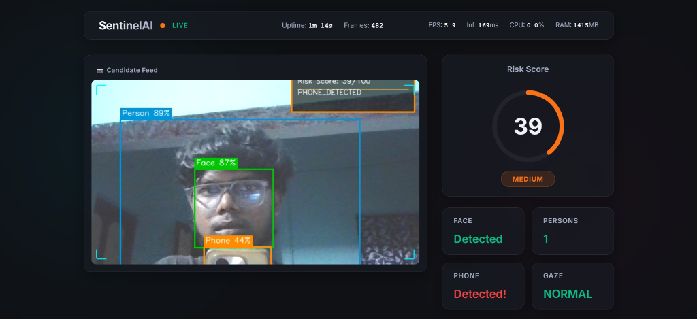
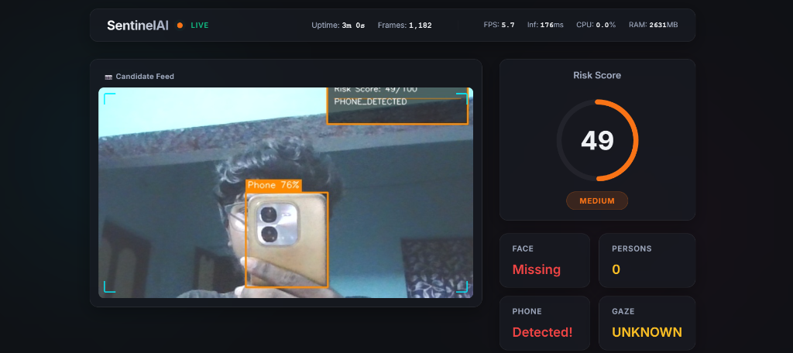
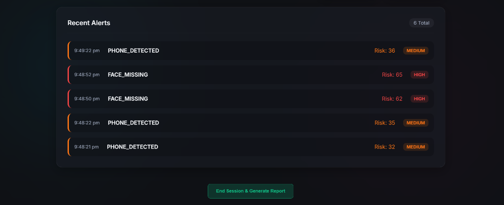
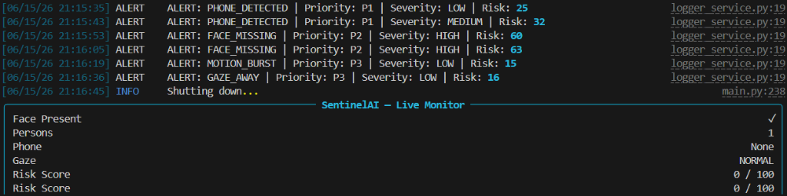
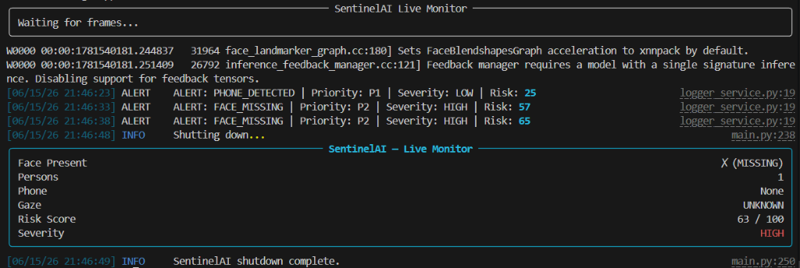

# SentinelAI – Intelligent Suspicious Activity Detection System

## Overview

SentinelAI is an enterprise-grade real-time computer vision monitoring and proctoring system designed to detect suspicious activities in webcam or video streams using AI-powered object detection, temporal event tracking, and rule-based decision making.

The system continuously monitors user behavior, validates events over time to reduce false positives, captures evidence of violations, maintains structured logs, and generates real-time risk assessments.

SentinelAI follows a modular, production-oriented architecture inspired by modern online proctoring, surveillance monitoring, and exam integrity systems.

---

## Key Features

### AI-Powered Detection

* Face Presence Detection using MediaPipe
* Person Detection using YOLOv8
* Mobile Phone Detection using YOLOv8
* Eye Gaze Monitoring using MediaPipe Face Mesh
* Suspicious Object Detection (Books, Notes, Cheat Sheets)
* Motion Burst Detection using Background Subtraction

### Temporal Validation Engine

* Face Missing > 10 Seconds
* Multiple Persons Present > 3 Seconds
* Phone Visible > 20 Consecutive Frames
* Gaze Away > 5 Seconds
* Suspicious Object Present > 15 Frames
* Motion Burst > 2 Seconds

### False Positive Suppression

* Temporal Validation
* Rolling Window Averaging
* Detection Confidence Thresholding
* Cooldown Gates
* Hysteresis-Based State Reset
* Event Deduplication

### Alert Management

* Real-Time Alert Generation
* Evidence Screenshot Capture
* Violation Cooldowns
* Alert Prioritization
* Violation Timeline Tracking

### Logging & Monitoring

* Structured JSON Logs
* Human Readable Logs
* Rotating Log Files
* Alert-Only Logging
* Session Monitoring

### Risk Assessment

* Composite Risk Score (0–100)
* Severity Classification
* Violation Aggregation
* Session Integrity Analysis

---

# System Architecture

```text
Frame Acquisition
        │
        ▼
Detection Layer
(MediaPipe + YOLOv8)
        │
        ▼
Event Tracking Layer
        │
        ▼
Rule Engine
        │
        ▼
Decision Engine
        │
        ▼
Alert Management
        │
        ▼
Logging System
        │
        ▼
Dashboard / API Output
```

---

# Project Structure

```text
SentinelAI/
├── app/
│   ├── detectors/
│   │   ├── face_detector.py
│   │   ├── object_detector.py
│   │   └── gaze_detector.py
│   │
│   ├── engine/
│   │   ├── rule_engine.py
│   │   ├── decision_engine.py
│   │   └── risk_scorer.py
│   │
│   ├── trackers/
│   │   ├── face_tracker.py
│   │   ├── person_tracker.py
│   │   ├── phone_tracker.py
│   │   └── gaze_tracker.py
│   │
│   ├── services/
│   │   ├── logger_service.py
│   │   ├── alert_service.py
│   │   ├── evidence_service.py
│   │   └── session_service.py
│   │
│   ├── api/
│   │   ├── routes.py
│   │   └── schemas.py
│   │
│   ├── config/
│   │   ├── settings.py
│   │   ├── thresholds.py
│   │   └── config.yaml
│   │
│   └── utils/
│       ├── helpers.py
│       ├── annotator.py
│       └── frame_buffer.py
│
├── tests/
│   ├── test_rules.py
│   ├── test_trackers.py
│   └── test_detectors.py
│
├── logs/
├── evidence/
├── models/
├── database/
├── main.py
├── requirements.txt
└── README.md
```

---

# Detection Modules

## Face Detection

Technology:

* MediaPipe Face Detection

Purpose:

* Verify candidate presence
* Detect face absence events

Output:

```json
{
  "face_present": true,
  "confidence": 0.94
}
```

---

## Object Detection

Technology:

* YOLOv8

Classes:

* Person
* Cell Phone
* Book
* Suspicious Objects

Output:

```json
{
  "person_count": 2,
  "phone_detected": true
}
```

---

## Gaze Estimation

Technology:

* MediaPipe Face Mesh

Tracks:

* Head Pose
* Eye Direction
* Screen Attention

Output:

```json
{
  "gaze_status": "AWAY"
}
```

---

# Violation Rules

| Rule              | Condition          | Threshold    |
| ----------------- | ------------------ | ------------ |
| FACE_MISSING      | Face absent        | > 10 seconds |
| MULTIPLE_PERSONS  | Person count > 1   | > 3 seconds  |
| PHONE_DETECTED    | Phone visible      | > 20 frames  |
| GAZE_AWAY         | Looking away       | > 5 seconds  |
| SUSPICIOUS_OBJECT | Object visible     | > 15 frames  |
| MOTION_BURST      | Excessive movement | > 2 seconds  |

---

# Decision Engine Output

```json
{
  "timestamp": "2026-06-15T14:30:01Z",
  "frame_id": 2456,
  "suspicious": true,
  "severity": "HIGH",
  "reasons": [
    "PHONE_DETECTED",
    "MULTIPLE_PERSONS"
  ],
  "confidence": 0.93,
  "face_present": true,
  "person_count": 2,
  "phone_detected": true,
  "gaze_status": "NORMAL",
  "risk_score": 82
}
```

---

# Evidence Capture

Every confirmed violation generates:

* Annotated Screenshot
* Timestamp Overlay
* Severity Label
* Evidence Index Entry

Example:

```text
evidence/
├── PHONE_DETECTED_2026-06-15_14-31-20.jpg
├── MULTIPLE_PERSONS_2026-06-15_14-40-18.jpg
└── index.json
```

---

# Logging System

### sentinel.log

Stores:

* System Events
* Detector Status
* Rule Evaluations
* Debug Information

### alerts.log

Stores:

* Violations
* Risk Escalations
* Critical Events

Example:

```text
[2026-06-15 14:31:20]
[ALERT]
PHONE_DETECTED
metadata={"confidence":0.94}
```

---

# Risk Scoring Model

| Violation         | Score |
| ----------------- | ----- |
| Face Missing      | 30    |
| Multiple Persons  | 40    |
| Phone Detected    | 50    |
| Gaze Away         | 15    |
| Suspicious Object | 35    |
| Motion Burst      | 20    |

Severity Levels:

| Risk Score | Severity |
| ---------- | -------- |
| 0–20       | SAFE     |
| 21–40      | LOW      |
| 41–60      | MEDIUM   |
| 61–80      | HIGH     |
| 81–100     | CRITICAL |

---

# Installation

## Clone Repository

```bash
git clone https://github.com/Sarojnamabathula/Suspicious_Activity-Detection.git
cd Suspicious_Activity-Detection
```

## Create Virtual Environment

```bash
python -m venv venv
```

### Windows

```bash
venv\Scripts\activate
```

### Linux/Mac

```bash
source venv/bin/activate
```

## Install Dependencies

```bash
pip install -r requirements.txt
```

---

# Running SentinelAI

```bash
python main.py
```

---

# Running Tests

```bash
pytest tests/
```

---

# Performance Optimizations

* YOLOv8 Nano for Real-Time Inference
* Frame Skipping
* Rolling Window Smoothing
* Cooldown Gates
* Event Deduplication
* Confidence Filtering

---

# Future Enhancements

* Face Recognition (FaceNet)
* Emotion Recognition
* Voice Activity Detection
* Multi-Camera Support
* Cloud Dashboard
* WebSocket Streaming
* REST API Integration
* Firebase/Supabase Backend
* Docker Deployment
* Kubernetes Scaling
* Exam Integrity Analytics

---

# Technologies Used

* Python 3.10+
* OpenCV
* MediaPipe
* YOLOv8
* NumPy
* FastAPI
* SQLite
* PyTest
* Logging
* Pydantic

---

# Use Cases

* Online Examination Monitoring
* Remote Interview Monitoring
* Secure Workspace Surveillance
* Classroom Integrity Systems
* Employee Compliance Monitoring

---

# Author

Saroj Namabathula

AI/ML Engineer | Computer Vision Enthusiast | Full Stack Developer

---

# License

This project is intended for educational, research, and demonstration purposes. Commercial deployment may require additional compliance, privacy, and security considerations.

---

# Live Dashboard & Telemetry

The modern web dashboard built with FastAPI and vanilla HTML/CSS provides real-time tracking of candidate behavior, risk aggregation, and hardware telemetry.

### Candidate Monitoring


### Phone & Face Missing Detection


### Session Violation Timeline


---

# Terminal Monitor Output

### Normal Session


### High Risk Session

